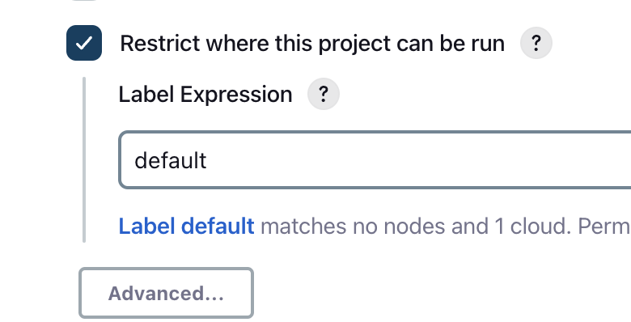
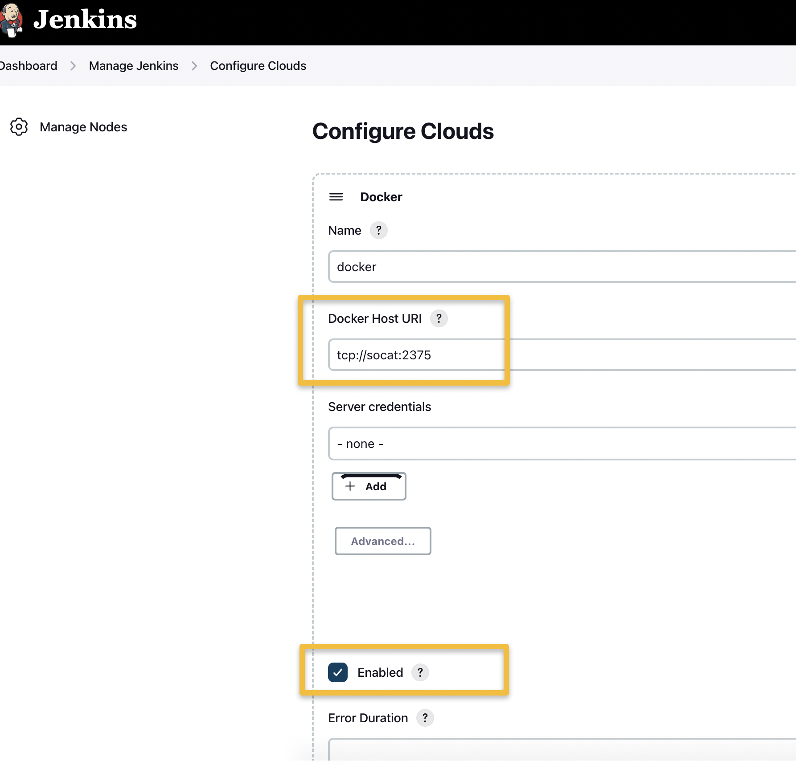
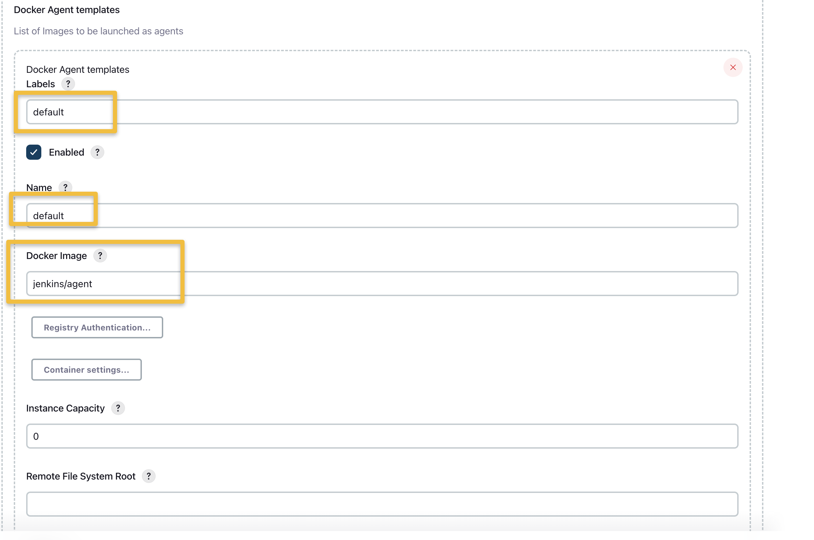

# Jenkins on Docker using JCaSC

Prerequisites

- https://github.com/jvalentino/example-docker-jenkins

References

- https://github.com/jenkinsci/configuration-as-code-plugin/blob/master/README.md
- https://github.com/hms-dbmi/avillachlab-jenkins/blob/master/jenkins-docker/Dockerfile
- https://docs.docker.com/engine/install/ubuntu/#install-using-the-repository
- https://github.com/bpack/docker-socat
- https://stackoverflow.com/questions/47854463/docker-got-permission-denied-while-trying-to-connect-to-the-docker-daemon-socke

# Summary

This is a Jenkins instance that is configured to:

1. Run inside a docker container
2. Use a second docker container to host dynamic agents, also based on docker iamges
3. Uses configuration as code to manage jenkins configuration via jcasc/jenkins.yaml
4. Plugins are managed via plugins/plugins.txt

# How to run this project

## (1) Start it

```bash
docker compose up --build -d
```

...making sure to pull the one time password out of the logs.

## (2) Go through Jenkins setup

Use the password out of the logs to unlock it, and then install recommended plugins.

## (3) Config as Code Plugin

You only have to do this if you didn't use --build in your compose command.


Restart

You will now see that the config as code plugin is working:


## (4) Jobs will run in their own container




This is because I configured the Docker Cloud:





# How I set up this image step by step

## (1) Config as Code Plugin


http://localhost:8080/manage/configuration-as-code/viewExport

```yaml
jenkins:
  agentProtocols:
  - "JNLP4-connect"
  - "Ping"
  authorizationStrategy:
    loggedInUsersCanDoAnything:
      allowAnonymousRead: false
  crumbIssuer:
    standard:
      excludeClientIPFromCrumb: false
  disableRememberMe: false
  labelAtoms:
  - name: "built-in"
  markupFormatter: "plainText"
  mode: NORMAL
  myViewsTabBar: "standard"
  numExecutors: 2
  primaryView:
    all:
      name: "all"
  projectNamingStrategy: "standard"
  quietPeriod: 5
  remotingSecurity:
    enabled: true
  scmCheckoutRetryCount: 0
  securityRealm:
    local:
      allowsSignup: false
      enableCaptcha: false
      users:
      - id: "admin"
        name: "admin"
        properties:
        - "myView"
        - preferredProvider:
            providerId: "default"
        - "timezone"
        - mailer:
            emailAddress: "admin@admin.com"
        - "apiToken"
  slaveAgentPort: 50000
  updateCenter:
    sites:
    - id: "default"
      url: "https://updates.jenkins.io/update-center.json"
  views:
  - all:
      name: "all"
  viewsTabBar: "standard"
globalCredentialsConfiguration:
  configuration:
    providerFilter: "none"
    typeFilter: "none"
security:
  apiToken:
    creationOfLegacyTokenEnabled: false
    tokenGenerationOnCreationEnabled: false
    usageStatisticsEnabled: true
  gitHooks:
    allowedOnAgents: false
    allowedOnController: false
  gitHostKeyVerificationConfiguration:
    sshHostKeyVerificationStrategy: "knownHostsFileVerificationStrategy"
  sSHD:
    port: -1
unclassified:
  buildDiscarders:
    configuredBuildDiscarders:
    - "jobBuildDiscarder"
  buildStepOperation:
    enabled: false
  email-ext:
    adminRequiredForTemplateTesting: false
    allowUnregisteredEnabled: false
    charset: "UTF-8"
    debugMode: false
    defaultBody: |-
      $PROJECT_NAME - Build # $BUILD_NUMBER - $BUILD_STATUS:

      Check console output at $BUILD_URL to view the results.
    defaultSubject: "$PROJECT_NAME - Build # $BUILD_NUMBER - $BUILD_STATUS!"
    defaultTriggerIds:
    - "hudson.plugins.emailext.plugins.trigger.FailureTrigger"
    maxAttachmentSize: -1
    maxAttachmentSizeMb: -1
    precedenceBulk: false
    watchingEnabled: false
  fingerprints:
    fingerprintCleanupDisabled: false
    storage: "file"
  gitHubConfiguration:
    apiRateLimitChecker: ThrottleForNormalize
  gitHubPluginConfig:
    hookUrl: "http://localhost:8080/github-webhook/"
  globalTimeOutConfiguration:
    operations:
    - "abortOperation"
    overwriteable: false
  injectionConfig:
    allowUntrusted: false
    enabled: false
    injectCcudExtension: false
    injectMavenExtension: false
  junitTestResultStorage:
    storage: "file"
  location:
    adminAddress: "address not configured yet <nobody@nowhere>"
    url: "http://localhost:8080/"
  mailer:
    charset: "UTF-8"
    useSsl: false
    useTls: false
  pollSCM:
    pollingThreadCount: 10
  scmGit:
    addGitTagAction: false
    allowSecondFetch: false
    createAccountBasedOnEmail: false
    disableGitToolChooser: false
    hideCredentials: false
    showEntireCommitSummaryInChanges: false
    useExistingAccountWithSameEmail: false
  timestamper:
    allPipelines: false
    elapsedTimeFormat: "'<b>'HH:mm:ss.S'</b> '"
    systemTimeFormat: "'<b>'HH:mm:ss'</b> '"
tool:
  git:
    installations:
    - home: "git"
      name: "Default"
  mavenGlobalConfig:
    globalSettingsProvider: "standard"
    settingsProvider: "standard"
```

## (2) Restart

docker-compose.yml

```yaml
version: '3.8'
services:
  jenkins:
    image: jenkins/jenkins:lts
    privileged: true
    user: root
    ports:
     - 8080:8080
     - 50000:50000
    container_name: jenkins_jcasc
    volumes:
     - /var/run/docker.sock:/var/run/docker.sock
     - ./jenkins_home:/var/jenkins_home
     - ./jcasc:/var/jcasc
    environment:
     - CASC_JENKINS_CONFIG=/var/jcasc
```


http://localhost:8080/manage/systemInfo


http://localhost:8080/manage/configuration-as-code/


## (3) Reload

jenkins.yaml

```yaml
  location:
    adminAddress: "foo@bar.com"
    url: "http://localhost:8080/"
```

http://localhost:8080/manage/configure


## (4) Plugins

Dockerfile

```dockerfile
FROM jenkins/jenkins:lts

COPY plugins/plugins.txt /var/plugins/plugins.txt

COPY jcasc/jenkins.yaml /var/jcasc/jenkins.yaml

RUN jenkins-plugin-cli -f /var/plugins/plugins.txt
```

docker-compose.yml

```yaml
version: '3.8'
services:
  jenkins:
    privileged: true
    user: root
    build: 
      context: .
      dockerfile: Dockerfile
    ports:
     - 8080:8080
     - 50000:50000
    container_name: jenkins_jcasc
    volumes:
     - /var/run/docker.sock:/var/run/docker.sock
     - ./jenkins_home:/var/jenkins_home
     - ./jcasc:/var/jcasc
     - ./plugins:/var/plugins
    environment:
     - CASC_JENKINS_CONFIG=/var/jcasc
```

## (5) Docker Agents

This was quite a pain to figure out, becuase the internet is full of examples that don't actualy work.

Consider that you have to be running dockerd on a host that can be accessed via TCP, so I found that you can use a second container to do this:

docker-compose.yml

```yaml
version: '3.8'
services:
  jenkins:
    privileged: true
    user: root
    build: 
      context: .
      dockerfile: Dockerfile
    ports:
     - 8080:8080
     - 50000:50000
    container_name: jenkins_jcasc
    volumes:
     - /var/run/docker.sock:/var/run/docker.sock
     - ./jenkins_home:/var/jenkins_home
     - ./jcasc:/var/jcasc
     - ./plugins:/var/plugins
    environment:
     - CASC_JENKINS_CONFIG=/var/jcasc
     - DOCKER_HOST=tcp://socat:2375
    links:
      - socat

  socat:
     image: bpack/socat
     command: TCP4-LISTEN:2375,fork,reuseaddr UNIX-CONNECT:/var/run/docker.sock
     volumes:
        - /var/run/docker.sock:/var/run/docker.sock
     expose:
        - "2375"
```

The socat image is used to host docker as a service.

...but because i also want to be able to build docker, I am running docker in docker on the Jenkins host itself, which required me to use a Dockerfile:

```dockerfile
FROM jenkins/jenkins:lts

USER root
COPY plugins/plugins.txt /var/plugins/plugins.txt

COPY jcasc/jenkins.yaml /var/jcasc/jenkins.yaml

RUN jenkins-plugin-cli -f /var/plugins/plugins.txt


RUN curl -fsSL https://get.docker.com -o get-docker.sh
RUN sh get-docker.sh
COPY docker.service /lib/systemd/system/docker.service

RUN usermod -aG docker root
```

